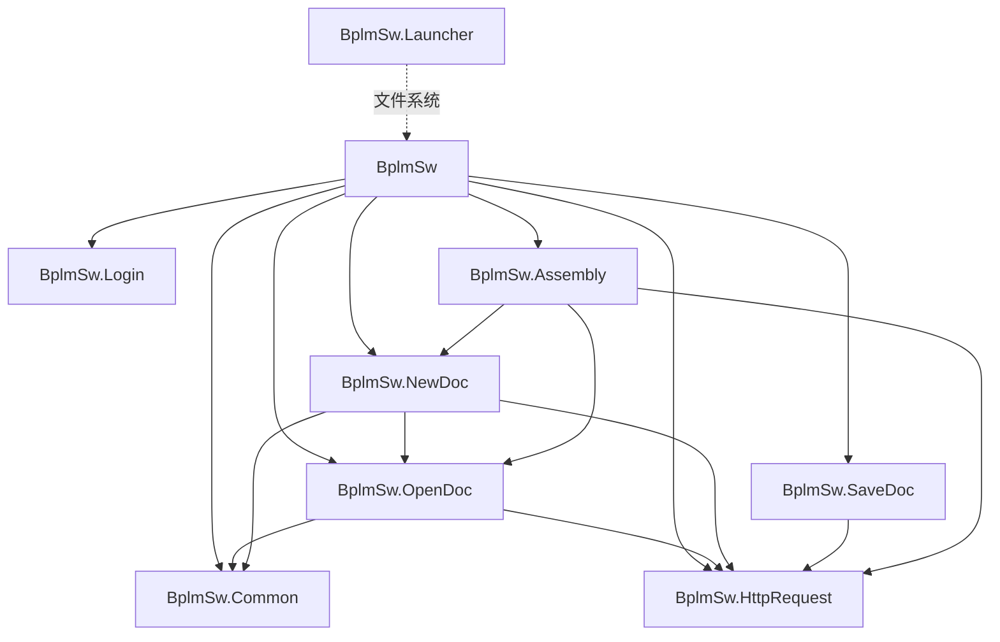
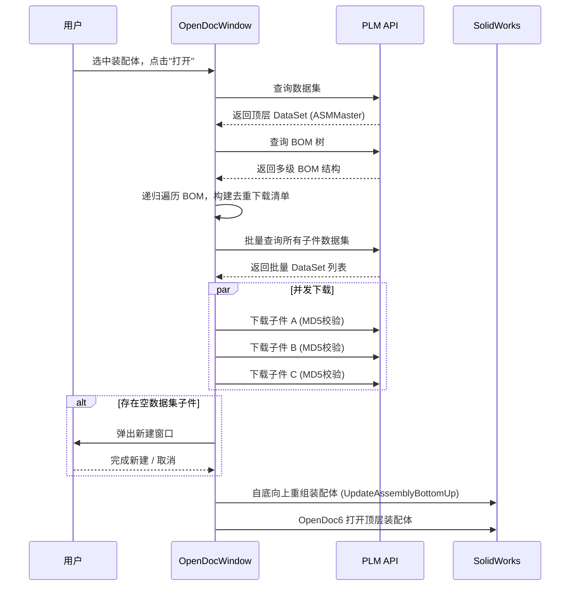
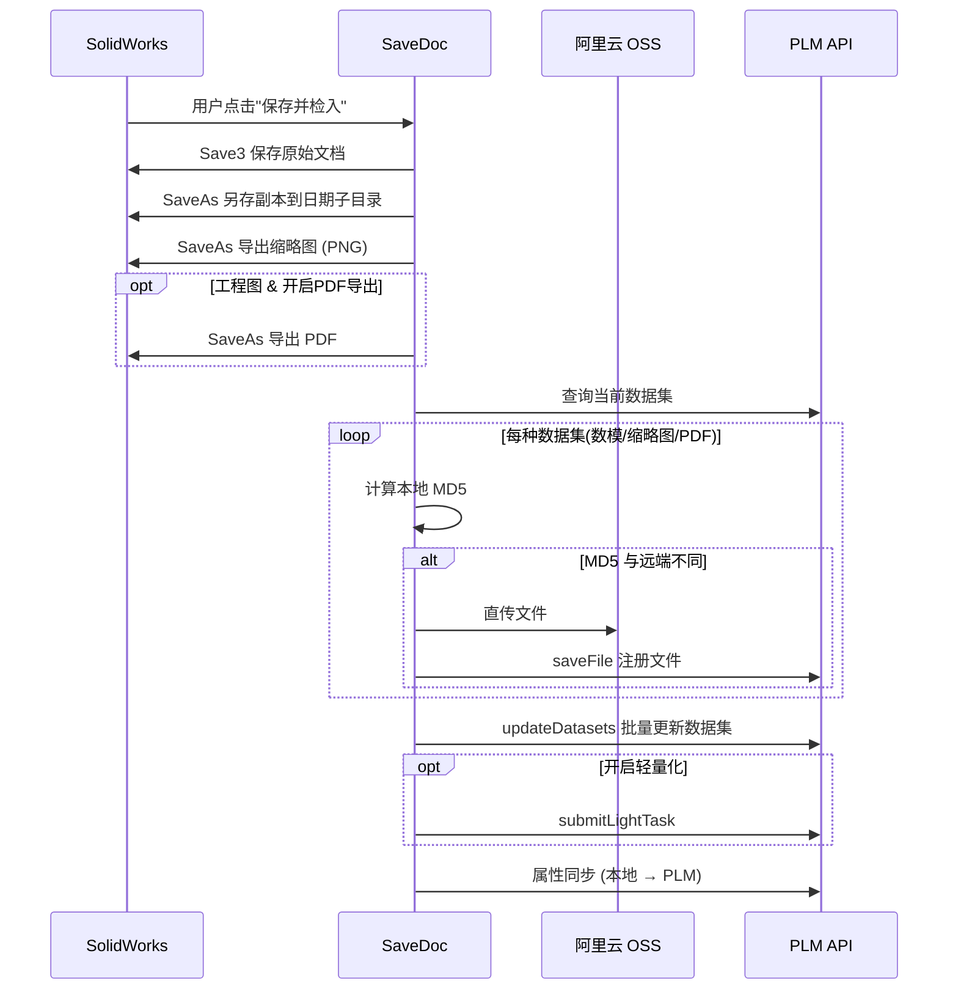

# BplmSw —— SolidWorks PLM 集成插件 规格说明书

## 1. 项目概述

**BplmSw** 是一款基于 **XCAD 框架** 开发的 **SolidWorks 插件**，用于将 SolidWorks 与企业 BPLM（Product Lifecycle Management）系统深度集成。插件实现了从 PLM 系统直接打开、新建、保存和管理 SolidWorks 文档的完整工作流，支持零件（PRT）、装配体（ASM）和工程图（DRW）三种文档类型。

### 核心价值

- **双向数据同步**：PLM 属性 ↔ SolidWorks 自定义属性的双向读写
- **文件生命周期管理**：签入/签出（Check-In/Check-Out）机制保障并发协作安全
- **Web 唤醒集成**：支持通过 URL Protocol (`BSWLauncher://`) 从 PLM Web 端直接唤起 SolidWorks 打开指定零部件

---

## 2. 技术架构

### 2.1 解决方案结构

| 项目模块 | 类型 | 职责 |
|---|---|---|
| **BplmSw** | SolidWorks 插件（COM 组件） | 主入口，工具栏/右键菜单/TaskPane，命令分发 |
| **BplmSw.Common** | 类库 | 共享接口（`INewDocService`）、会话上下文（`SessionContext`）、服务定位器 |
| **BplmSw.HttpRequest** | 类库 | 全部 PLM REST API 封装、HTTP 客户端、响应模型、工具类 |
| **BplmSw.Login** | WPF 类库 | 登录窗口 UI |
| **BplmSw.OpenDoc** | WPF 类库 | 打开文件窗口，支持目录浏览/搜索/属性预览/BOM 遍历下载 |
| **BplmSw.NewDoc** | WPF 类库 | 新建文档窗口，模板选择/属性填写/编码指派/文件夹选择 |
| **BplmSw.SaveDoc** | 类库 | 保存并上传文档到 PLM（数模/缩略图/PDF），OSS 直传，MD5 校验 |
| **BplmSw.Assembly** | 类库 | 装配体操作：添加组件、新建组件、替换组件 |
| **BplmSw.Launcher** | 控制台应用 | URL Protocol 处理器，解析 `BSWLauncher://` 协议参数，写入 JSON 配置，唤起/置顶 SolidWorks |

### 2.2 依赖关系



> [!NOTE]
> `BplmSw.OpenDoc` 与 `BplmSw.NewDoc` 之间通过 `INewDocService` 接口（定义于 `BplmSw.Common`）解耦，避免循环依赖。

### 2.3 技术栈

- **语言**：C# (.NET Framework 4.7.2)
- **UI**：WPF (XAML + Code-Behind)
- **SolidWorks API**：SolidWorks.Interop.sldworks / swconst
- **插件框架**：XCAD (Xarial.XCad.SolidWorks)
- **HTTP**：System.Net.Http.HttpClient
- **JSON**：Newtonsoft.Json
- **文件存储**：阿里云 OSS 直传
- **进程间通信**：文件系统（`LoginArgs.json` + `FileSystemWatcher`）

---

## 3. 功能模块详述

### 3.1 用户认证

| 功能 | 描述 |
|---|---|
| **手动登录** | 弹出登录窗口，输入工号和密码，获取 JWT Token |
| **自动登录** | Web 唤醒时自动携带 Token，验证有效性后直接登录 |
| **注销** | 清除内存和本地持久化的 Token |
| **Token 持久化** | 保存至 `%AppData%/BplmSwLauncher/LoginArgs.json` |
| **Token 校验** | 每个操作前检查 Token 有效性，过期则引导重新登录 |

### 3.2 文档操作

#### 3.2.1 新建文档（NewDoc）

- 从预配置的 SolidWorks 模板创建新文档（零件/装配体/工程图）
- 支持 **项类型映射**：根据选中模板过滤可用的 PLM 项类型
- **编码指派**：调用 PLM API 自动分配零部件编码 (`item_id`) 和版本号 (`item_revision_id`)
- **属性填写**：必填属性验证 + 全部属性弹窗编辑
- **文件夹选择**：浏览 PLM 文件夹结构，选择存放位置
- **集成新建**：当打开空数据集零部件时自动触发，预填 PLM 属性
- 新建完成后自动 **签出** 文档，**另存** 至本地缓存目录

#### 3.2.2 打开文档（OpenDoc）

- **目录浏览模式**：Tree 视图懒加载 PLM 文件夹/零部件结构
- **搜索模式**：按编码、名称、项类型进行高级搜索，支持分页
- **预览**：显示缩略图、版本历史、属性列表
- **单文件打开**（PRT/DRW）：
  1. 查询数据集 → 2. MD5 校验/下载 → 3. 用 SolidWorks 打开
- **装配体打开**（ASM）：
  1. 查询 BOM 树 → 2. 递归遍历去重 → 3. 批量查询数据集 → 4. **并发下载**所有子件 → 5. 空数据集弹出新建窗口 → 6. **自底向上重组装配体** → 7. 打开顶层装配体
- **Selection 模式**：仅返回选中零部件的 UID，用于添加组件等场景

#### 3.2.3 保存文档（SaveDoc）

- **另存副本**用于上传（避免上传内存中未落盘的数据）
- **多数据集上传**：数模文件 + 缩略图（PNG），工程图可选导出 PDF
- **OSS 直传**：文件直传至阿里云 OSS，获取 fileId 后更新 PLM 数据集记录
- **MD5 增量上传**：本地 MD5 与远端对比，仅在不同时上传
- **属性回写**：将 SolidWorks 中修改的非只读属性同步回 PLM
- **轻量化任务**：可选提交轻量化转换任务
- **保存选项**：用户可配置是否保存轻量化数据、是否导出 PDF

#### 3.2.4 签入/签出（Check-In/Check-Out）

- **工具栏按钮 + 右键菜单**双入口
- **状态感知**：根据当前文档的签入状态动态启用/禁用按钮
- **自动签出**：文档重建（Rebuilt）或属性变更时自动签出，10 分钟冷却期防止频繁操作
- **自动签入**：文档关闭时自动签入
- **TaskPane 同步**：签入/签出状态同步到 TaskPane 面板按钮

### 3.3 装配体管理

| 功能 | 描述 |
|---|---|
| **添加组件** | 从 PLM 选择已有零部件，下载后添加至当前装配体，自动固定 |
| **新建组件** | 在当前装配体中新建零部件，创建后自动添加并固定 |
| **替换组件** | 替换装配体中的已有组件（通过独立窗口操作） |

### 3.4 Web 唤醒（URL Protocol）

```
BSWLauncher://{token},{puid},{objectType}
```

**启动流程**：

1. PLM Web 端通过 URL Protocol 调用 `BplmSw.Launcher.exe`
2. Launcher 解析参数，写入 `LoginArgs.json`
3. 如果 SolidWorks 未运行 → 启动 SolidWorks
4. 如果 SolidWorks 已运行 → 还原/置顶窗口
5. 插件内 `FileSystemWatcher` 监听到 `LoginArgs.json` 变更
6. 读取 Token/PUID/ObjectType → 自动登录 → 自动打开指定零部件

### 3.5 TaskPane 侧边面板

- 集成于 SolidWorks 任务窗格
- 提供签出/签入快捷按钮
- 按钮状态与当前活动文档同步

---

## 4. PLM API 接口清单

| 分类 | 接口 | 方法 | 用途 |
|---|---|---|---|
| **认证** | `/bidp-system/tSysUser/login` | GET | 用户登录 |
| | `/bidp-system/iam/isLogin` | POST | Token 有效性验证 |
| | `/bidp-system/workbench/getPersonalInfo` | GET | 获取用户信息 |
| **文件夹** | `/bplm-pdm/itemManager/getCurrentUserHomeDirectory` | GET | 获取用户主目录 |
| | `/bplm-pdm/itemManager/getChildFolderListByParentFolder` | GET | 获取子文件夹 |
| | `/bplm-pdm/itemManager/getChildListByParentObject` | GET | 获取子对象（懒加载） |
| **零部件** | `/bplm-pdm/spareParts/partsDataManageAdd` | POST | 创建零部件 |
| | `/bplm-pdm/spareParts/getItemCode` | POST | 指派编码 |
| | `/bplm-pdm/spareParts/getItemVersion` | POST | 指派版本号 |
| | `/bplm-pdm/itemManager/getAllBomLineByParent` | GET | 获取 BOM 树 |
| **数据集** | `/bplm-pdm/partAttachment/getPartAttachmentByPartIdBatch` | POST | 批量查询数据集 |
| | `/bplm-pdm/partAttachment/partAttachmentDeleteBatch` | POST | 批量删除数据集 |
| | `/bplm-pdm/partAttachment/partAttachmentUploadBatch` | POST | 批量创建数据集 |
| **文件** | `/bplm-file/bidp-file/downLoad` | GET | 下载文件 |
| | `/bplm-file/bidp-file/saveFile` | POST | 注册已上传文件 |
| **签入签出** | `/bplm-pdm/itemManager/checkIn` | POST | 签入 |
| | `/bplm-pdm/itemManager/checkOutSingle` | POST | 签出 |
| | `/bplm-pdm/spareParts/batchGetCheckInStatus` | POST | 批量查询签入状态 |
| **属性** | 属性查询/编辑接口 | POST | 查询/修改零部件属性 |
| **搜索** | 高级搜索接口 | POST | 按编码/名称/类型搜索 |

---

## 5. 数据模型

### 5.1 会话上下文 (`SessionContext`)

| 字段 | 类型 | 描述 |
|---|---|---|
| `Token` | string | JWT 认证 Token |
| `Puid` | string | 当前操作的零部件版本 UID |
| `ObjectType` | string | 当前操作的对象类型 |
| `IsWeb` | string | 是否由 Web 唤醒（"1" 表示是） |
| `UserId` | string | 用户工号 |
| `UserName` | string | 用户姓名 |

### 5.2 PLM 项类型体系

插件通过外部 JSON 配置文件（`ConfigParser` 解析）维护：

- **项类型中英映射** (`SwItemTypeMap`)：如 `Z9_Components` ↔ `零部件`
- **属性定义** (`SwAttrs`)：每种项类型的属性列表，含 AttrId、Description（中文描述）、ReadOnly、Required、Mode 等字段
- **模板配置** (`SwTemplates`)：每种模板的文件名、数据集类型、文件后缀、支持的项类型列表

### 5.3 核心常量

| 常量 | 值 | 描述 |
|---|---|---|
| `SW_CACHE_PATH` | `D:\BplmSwData\` | 本地文件缓存目录 |
| `DATASET_PRT_MASTER` | `PRTMaster` | 零件数据集类型 |
| `DATASET_ASM_MASTER` | `ASMMaster` | 装配体数据集类型 |
| `DATASET_DRW_MASTER` | `DRWMaster` | 工程图数据集类型 |
| `REVISION_SUFFIX` | `Revision` | 版本对象类型后缀 |

---

## 6. 关键流程

### 6.1 打开装配体完整流程



### 6.2 保存上传流程



---

## 7. 文件索引

| 路径 | 行数 | 描述 |
|---|---|---|
| [BplmSwAddIn.cs](file:///d:/AIDemo/antigravity2/BplmSw/BplmSwAddIn.cs) | 812 | 插件主入口，命令分发，文件监听，Token 管理 |
| [SwCommands.cs](file:///d:/AIDemo/antigravity2/BplmSw/SwCommands.cs) | 96 | 工具栏命令和右键菜单枚举定义 |
| [MyDocumentHandler.cs](file:///d:/AIDemo/antigravity2/BplmSw/MyDocumentHandler.cs) | 137 | 文档事件处理器（自动签入签出、属性变更监听） |
| [TaskPanelVM.cs](file:///d:/AIDemo/antigravity2/BplmSw/ViewModels/TaskPanelVM.cs) | - | TaskPane 面板 ViewModel |
| [HttpRequest.cs](file:///d:/AIDemo/antigravity2/BplmSw.HttpRequest/HttpRequest.cs) | 1478 | 全部 PLM REST API 客户端封装 |
| [Responses.cs](file:///d:/AIDemo/antigravity2/BplmSw.HttpRequest/Responses.cs) | 207 | HTTP 响应数据模型 |
| [Constants.cs](file:///d:/AIDemo/antigravity2/BplmSw.HttpRequest/Constants.cs) | 73 | 全局常量定义 |
| [ConfigParser.cs](file:///d:/AIDemo/antigravity2/BplmSw.HttpRequest/Utils/ConfigParser.cs) | - | JSON 配置文件解析器（项类型、属性、模板） |
| [TokenManager.cs](file:///d:/AIDemo/antigravity2/BplmSw.HttpRequest/Utils/TokenManager.cs) | - | Token 持久化管理 |
| [MD5Util.cs](file:///d:/AIDemo/antigravity2/BplmSw.HttpRequest/Utils/MD5Util.cs) | - | MD5 校验 & BOM 下载工具 |
| [OssUtil.cs](file:///d:/AIDemo/antigravity2/BplmSw.HttpRequest/Utils/OssUtil.cs) | - | 阿里云 OSS 文件上传 |
| [OpenDocWindow.xaml.cs](file:///d:/AIDemo/antigravity2/BplmSw.OpenDoc/OpenDocWindow.xaml.cs) | 1022 | 打开文件窗口逻辑 |
| [NewDocWindow.xaml.cs](file:///d:/AIDemo/antigravity2/BplmSw.NewDoc/NewDocWindow.xaml.cs) | 704 | 新建文档窗口逻辑 |
| [SaveDoc.cs](file:///d:/AIDemo/antigravity2/BplmSw.SaveDoc/SaveDoc.cs) | 305 | 保存上传逻辑 |
| [AddComp.cs](file:///d:/AIDemo/antigravity2/BplmSw.Assembly/AddComp.cs) | 144 | 添加组件 |
| [NewComp.cs](file:///d:/AIDemo/antigravity2/BplmSw.Assembly/NewComp.cs) | 65 | 新建组件 |
| [Program.cs](file:///d:/AIDemo/antigravity2/BplmSw.Launcher/Program.cs) | 122 | URL Protocol 启动器 |
| [SessionContext.cs](file:///d:/AIDemo/antigravity2/BplmSw.Common/SessionContext.cs) | 19 | 全局会话状态 |
| [INewDocService.cs](file:///d:/AIDemo/antigravity2/BplmSw.Common/INewDocService.cs) | 19 | 新建文档服务接口 |
| [LoginWindow.xaml.cs](file:///d:/AIDemo/antigravity2/BplmSw.Login/Views/LoginWindow.xaml.cs) | - | 登录窗口 |

---

## 8. 工具栏命令一览

| 命令 | 显示名称 | 可用环境 | 描述 |
|---|---|---|---|
| `Login` | 登录 | 全局 | 弹出登录对话框 |
| `Logout` | 注销 | 全局 | 清除会话 |
| `NewDoc` | 新建 | 全局 | 新建 PLM 零部件 + SolidWorks 文档 |
| `OpenDoc` | 打开 | 全局 | 从 PLM 浏览/搜索并打开文档 |
| `Save` | 保存并检入 | 全局 | 保存文档并上传至 PLM |
| `SaveOption` | 保存选项 | 全局 | 配置保存行为（轻量化/PDF） |
| `CheckOutDoc` | 签出文件 | 全局 | 手动签出当前文档 |
| `CheckInDoc` | 签入文件 | 全局 | 手动签入当前文档 |
| `NewComp` | 新建组件 | 装配体 | 在装配体中新建子组件 |
| `AddComp` | 添加组件 | 装配体 | 将 PLM 已有零部件添加到装配体 |
| `ReplaceComp` | 替换组件 | 装配体 | 替换装配体中的组件 |

**右键菜单**（组件节点）：签出 / 签入
